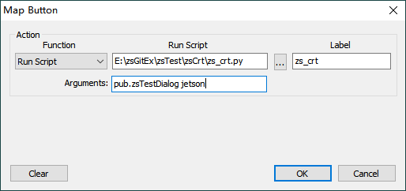

# zsTest-与测试相关的工程

## zsCrt-secureCRT脚本工程

### 简介

基于python制作CRT脚本

- 封装了原生脚本命令，如果换其他工具如xshell，则只需少量代码即可切换
- 统一脚本命令入口，这样只需少量文件就可以囊括所有命令函数，且函数间可以复用，解决传统情况下一个按钮执行一个脚本，且脚本间功能不能复用的问题
- 模块化，在脚本规模较大时，根据函数功能分布到不同的脚本文件中，可以互相引用，更加复合工程原则

脚本统一入口为zs_crt.py

按钮添加示例如下图

### 后续改进

[使用面向对象封装改善易用性](https://blog.csdn.net/MrRight17/article/details/82874479)
[制作成体系的工具箱](https://blog.csdn.net/MrRight17/article/details/82874479)

## zsGitInspector-git库代码统计工具

### 简介

基于gitinspector from github，做了一点易用性改进，总的功能如下

- 通过配置，能够准确统计某项目各个Git库中，某段时间内，所有用户的代码增加，删除情况，考虑到一些特殊需求并解决
- 考虑到一个开发人员有多个提交用户名/邮箱，提供合并用户的功能
- 通过合并用户，可以在团队间比较代码提交量
- 统计中去掉merge的提交
- 提供过滤功能，过滤掉某次提交，过滤掉某目录所有文件，过滤掉某文件，过滤掉某作者等
- 只统计某些文件类型（通过后缀区分）
- 提供写入excel功能，数据可视性强
